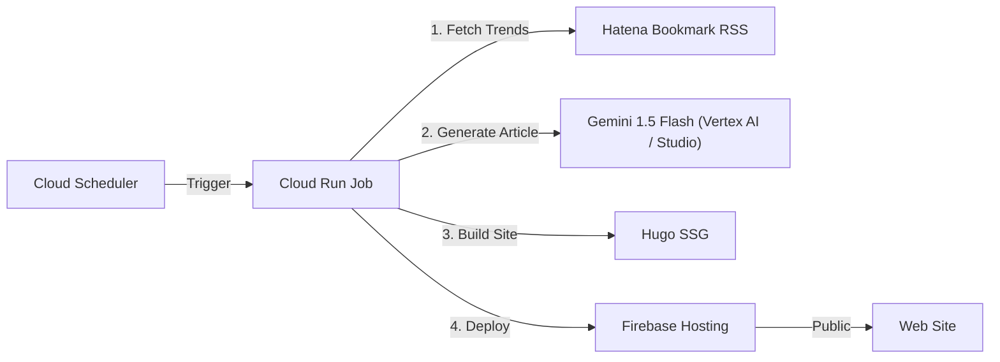

# AI Money Maker (Trend Blog Bot) 🤖💰

**完全自動化されたトレンドブログ運用システム**

検索トレンドやニュース（Hatena Bookmark）から話題のキーワードを自動取得し、Google Gemini (AI) がSEO最適化された記事を執筆。Hugoで静的サイトを構築し、Firebase Hostingへ自動デプロイする一連の流れを、Cloud Run Jobs + Cloud Scheduler で完全自動化しています。

## 🚀 システムアーキテクチャ



## 🛠️ 技術スタック

- **Language**: Python 3.11, Bash
- **AI**: Google Gemini 1.5 Flash (via `google-generativeai`)
- **SSG**: Hugo (Theme: Ananke)
- **Infrastructure**:
  - Google Cloud Run Jobs (Serverless Container)
  - Google Cloud Scheduler (Cron)
  - Firebase Hosting (CDN)
  - Google Artifact Registry (Docker Image)

## 📦 ディレクトリ構成

- `src/`: Pythonソースコード (トレンド取得、記事生成、メインロジック)
- `blog/`: Hugoプロジェクト
- `scripts/`: ユーティリティスクリプト
- `Dockerfile`: Cloud Run用コンテナ定義
- `.agent/workflows/`: デプロイ手順書
- `firebase.json`: Hosting設定

## 🏁 セットアップ手順

### 1. 必須要件
- Google Cloud Project (Billing Enabled)
- Gemini API Key (Google AI Studio)
- Firebase CLI (`firebase-tools`)

### 2. 環境変数 (.env)
ルートディレクトリに `.env` を作成し、以下を設定します（`.gitignore`対象）。
```bash
GEMINI_API_KEY=AIza...
FIREBASE_TOKEN=... (CI用トークン)
GOOGLE_CLOUD_PROJECT=your-project-id
```

### 3. ローカル実行 (テスト)
```bash
# 仮想環境作成
python -m venv venv
source venv/bin/activate
pip install -r requirements.txt

# テスト実行 (1記事生成)
python src/main.py --mode=test --count=1

# サーバー起動 (Hugo)
cd blog && hugo server
```

## 🚀 デプロイ (自動化)

詳細な手順は [.agent/workflows/deploy_trend_blog.md](.agent/workflows/deploy_trend_blog.md) を参照してください。

1. **Dockerビルド**: `docker build --platform linux/amd64 ...`
2. **プッシュ**: `docker push ...`
3. **Cloud Run Jobデプロイ**: `gcloud run jobs deploy ...`
4. **スケジューラ設定**: `gcloud scheduler jobs create ...`

## 📝 運用
- **記事生成**: 毎日 8:00, 12:00, 18:00 に自動実行されます。
- **ログ確認**: Google Cloud Console (Cloud Run Jobs) で確認可能。
